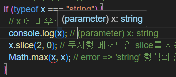
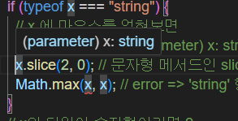
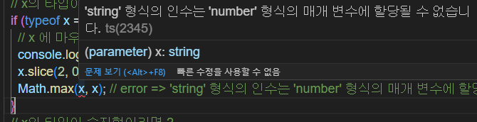
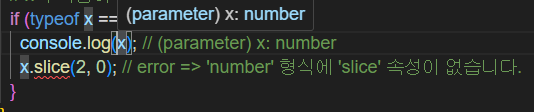
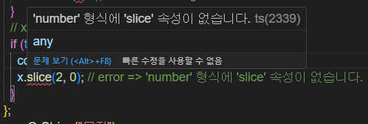

# 타입스크립트 타입의 별칭 !!


- `간단 요약` 타입가드를 사용해 타입을 좁혀 나갈 수 있다. !
- 좁혀진 타입으로 에러 빈도를 낮추고, 더욱 더 typeSafety함을 보장받을 수 있다. !

  <br/>
  <br/>

## 타입가드 란 ?!

- Type Guard를 통해 컴파일러가 타입을 예측할 수 있도록 타입을 좁혀(narrowing) 주어서 좀 더 type safety함을 보장할 수 있습니다.
  <br/>
  <br/>

## 타입가드 써보기

```typescript
// 매개변수 x는 숫자 or 문자
const numOrString = (x: number | string): void => {
  // x의 타입이 문자형이라면 ?
  if (typeof x === "string") {
    // x 에 마우스를 얹혀보면
    console.log(x); // (parameter) x: string
    x.slice(2, 0); // 문자형 메서드인 slice를 사용할 수 있다.
    Math.max(x, x); // error => 'string' 형식의 인수는 'number' 형식의 매개 변수에 할당될 수 없습니다.
  }
  // x의 타입이 숫자형이라면 ?
  if (typeof x === "number") {
    console.log(x); // (parameter) x: number
    x.slice(2, 0); // error => 'number' 형식에 'slice' 속성이 없습니다.
  }
};
numOrString("무지");
```

## 순서

1. `numOrString` 라는 함수가 있다 이 함수는 문자, 혹은 숫자형을 매개변수로 받아 사용되는 함수다.
2. 이 함수 내부에서 if문으로 타입이 `문자형`, `숫자형` 두가지의 타입가드가 있다.!
3. x의 `typeof === 'string` 이라면 그 안에서의 x는 `문자형 | 숫자형 ` 이 아닌 문자형으로만 치환한다. <br/>
    <br/><br/><br/>
   보다 싶히 x에 마우스를 얹혀보면 `x : string` 으로 나온다. <br/><br/>
    <br/><br/><br/>
   Math.max 처럼 숫자형 메서드, 내장함수는 사용되지 못한다.
    <br/><br/><br/>
4. x의 `typeof === 'number` 이라면 그 안에서의 x는 숫자형으로 치환된다.<br/><br/>

   <br/><br/><br/>
   number 형식에 slice가 없다고 나온다. <br/><br/>
   <br/><br/><br/>
