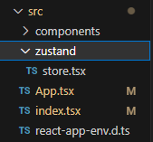

# 너도 할 수 있다. ! Zustand ! :outbox_tray:


## 오늘의 요약

- `zustand` 를 사용할 수 있다.
- `zustand` 를 사용해 전역관리를 할 수 있다.
- `github` https://github.com/muzi55/myZustand.git
- `공식문서` https://github.com/pmndrs/zustand

<br/>
<br/>

## Zustand Install :postal_horn:

```tsx
npm install zustand

or

yarn add zustand

or

pnpm add zustand
```

<br/>
<br/>

## Zustand 시작



- src 폴더 하위에 zustand 라는 폴더를 만들어주고 여기서 관리를 할거다.

<br/>

1.  가장먼저 zustand 폴더 안에 `store.tsx`를 만들어준다.

2.  `store.tsx` 안에 기본적인 보일러플레이트 코드를 작성해준다.

        ``` tsx
        // 보일러 플레이트 코드
        import { create } from 'zustand'
        import { devtools, persist } from 'zustand/middleware'

        interface BearState {}

        const useBearStore = create<BearState>()()
        ```

    <br/>
    <br/>

3.  간단한 카운터앱 만들기

    ```tsx
    // App.tsx
    import React from "react";
    import Bear from "./components/Bear";
    import Control from "./components/Control";
    import BearForm from "./components/BearForm";
    import BearList from "./components/BearList";
    function App() {
      return (
        <>
          <h1>쥬스탠드 학습</h1>
          <Bear />
          <Control />
        </>
      );
    }

    export default App;
    ```

    ```tsx
    // Bear.tsx
    import React from "react";
    import { useBearStore } from "./../zustand/store";

    const Bear = (): JSX.Element => {
      const { bears } = useBearStore((state) => state);
      return (
        <>
          <h2>Bear Components</h2>
          <p>{bears} : 마리 </p>
        </>
      );
    };

    export default Bear;
    ```

    ```tsx
    // Control.tsx
    import React, { useState } from "react";
    import { useBearStore } from "../zustand/store";

    const Control = (): JSX.Element => {
      const [input, setInput] = useState<number>(0);
      const increaseBears = useBearStore((state) => state.increase);
      const decreaseBears = useBearStore((state) => state.decrease);
      const resetBear = useBearStore((state) => state.resetBear);

      const onChangeInput = (e: React.ChangeEvent<HTMLInputElement>) => {
        setInput(+e.target.value);
      };

      return (
        <>
          <h2>Control Components</h2>
          <div>
            <input type="number" value={input} onChange={(e) => onChangeInput(e)} />
            <button onClick={() => increaseBears(input)}>곰 마릿수 증가</button>
            <button onClick={() => decreaseBears(input)}>곰 마릿수 감소</button>
            <button onClick={resetBear}>곰 몰살 시키기</button>
          </div>
        </>
      );
    };

    export default Control;
    ```

    ```tsx
    // store.tsx
    import React from "react";
    import { create } from "zustand";

    export interface BearList {
    id: number;
    name: string;
    age: number;
    isDone: boolean;
    }
    interface BearState {
    bears: number;
    bearList: BearList[];
    increase: (by: number) => void;
    decrease: (by: number) => void;
    resetBear: () => void;

    export const useBearStore = create<BearState>()((set) => ({
    bears: 0,
    increase: (by) => set((state) => ({ bears: state.bears + by })),
    decrease: (by) => set((state) => ({ bears: state.bears - by })),
    resetBear: () => set(() => ({ bears: 0 })),
    }));

    ```

<br/>
<br/>

- 간단한 카운트앱을 만들어보았다. 카운트앱을 만들었으니 이제 투두리스트 비스무리한걸 만들면 될거같다. !
- 리덕스와 다르게 provider로 감쌀필요없이 사용하는게 생각보다 편리했다. 특히 보일러플레이팅코드가 굉장히 적다는건 사용하기 정말 좋은 강점이다.
