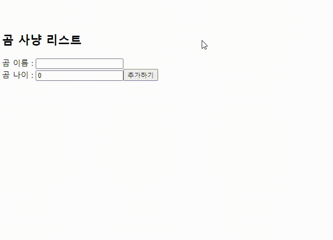

# 너도 할 수 있다. ! Zustand! Bear Hunted !! :outbox_tray:

## 어제에 이어서

- 어제는 zustand로 컴포넌트간의 전역상태관리로 카운트 앱을 만들었다.
- 이전 TIL https://github.com/muzi55/TIL/blob/main/23-08/0817.md

- 

<br/>
<br/>

## Bear Hunted !! 부터 시작

이번에 만들것은 곰을 포획하고 풀어주는 리스트를 만드는 <s>Todo List</s> 가 아닌 <strong>Bear Hunting List</strong> 이다.
<br/>
<br/>
곰을 잡고 곰을 풀어주는 간단한 투두.. 곰 사냥 리스트 ! 이제부터 시작한다.

##

```tsx
// App.tsx
import React from "react";
import Bear from "./components/Bear";
import Control from "./components/Control";
import BearForm from "./components/BearForm";
import BearList from "./components/BearList";
import { useQuery } from "@tanstack/react-query";

function App() {
  const getData = async () => {
    console.log(getData);
  };
  const { data, isLoading } = useQuery({
    queryKey: ["data"],
    queryFn: getData,
  });

  console.log(data);
  return (
    <>
      <h1>쥬스탠드 학습</h1>
      <Bear />
      <Control />
      <hr />

      <h2>곰 사냥 리스트</h2>
      <BearForm />
      <BearList />
    </>
  );
}

export default App;
```

<br/>
<br/>
<hr/>

```tsx
// store.tsx
import React from "react";
import { create } from "zustand";

// 잡은 곰들의 type이다.
export interface BearList {
  id: number;
  name: string;
  age: number;
  isDone: boolean;
}

interface BearState {
  // 기본 초기 값 타입
  bears: number;
  bearList: BearList[];

  //   업데이트 함수 타입
  increase: (by: number) => void;
  decrease: (by: number) => void;
  resetBear: () => void;
  addBear: (newBear: BearList) => void;
  switchBear: (id: number) => void;
  delBear: (id: number) => void;
}

// redux의 reducer 부분이다.
export const useBearStore = create<BearState>()((set) => ({
  // bearAge
  bears: 0,
  increase: (by) => set((state) => ({ bears: state.bears + by })),
  decrease: (by) => set((state) => ({ bears: state.bears - by })),
  resetBear: () => set(() => ({ bears: 0 })),

  // bearList
  bearList: [],

  // 잡은 곰을 [...기존 배열 + 새로운 값] 이런 방식입니다.
  addBear: (newBear: BearList) => set((state) => ({ bearList: [...state.bearList, newBear] })),

  // 잡은 곰을 삭제하는 로직입니다.
  // filter를 사용해 전달받은 id값과 다른값만 반환합니다.
  delBear: (id: number) =>
    set((state) => ({
      bearList: state.bearList.filter((el) => el.id !== id),
    })),

  // 잡은 곰의 포획여부를 판별하는 로직입니다.
  // map을 사용해 하나하나 비교를합니다.
  // 비교로직은 전달받은 id값이 id값과 같다면? state.isDone:!isDone : 기존값 반환
  switchBear: (id: number) =>
    set((state) => ({
      bearList: state.bearList.map((el) => (el.id === id ? { ...el, isDone: !el.isDone } : el)),
    })),
}));
```

<br/>
<br/>
<hr/>

```tsx
// BearForm.tsx
import React, { useState, useRef } from "react";
import { BearList, useBearStore } from "../zustand/store";

const BearForm = (): JSX.Element => {
  const [bearName, setBearName] = useState<string>("");
  const [bearAge, setBearAge] = useState<number>(0);

  const { addBear } = useBearStore((state) => state);
  const idRef = useRef<number>(0);

  const onSubmitForm = (e: React.FormEvent<HTMLFormElement>) => {
    e.preventDefault();
  };

  const onChangeName = (e: React.ChangeEvent<HTMLInputElement>): void => {
    setBearName(e.target.value);
  };

  const onChangeAge = (e: React.ChangeEvent<HTMLInputElement>) => {
    setBearAge(+e.target.value);
  };

  const addBearList = () => {
    if (!bearAge) return;
    if (!bearName) return;

    const newBear: BearList = {
      id: ++idRef.current,
      name: bearName,
      age: bearAge,
      isDone: false,
    };

    addBear(newBear);

    setBearAge(0);
    setBearName("");
  };

  return (
    <>
      <form onSubmit={(e) => onSubmitForm(e)} action="#">
        <label htmlFor="name">곰 이름 : </label>
        <input onChange={(e) => onChangeName(e)} value={bearName} type="text" name="name" id="name" />
        <br />
        <label htmlFor="name">곰 나이 : </label>
        <input onChange={(e) => onChangeAge(e)} value={bearAge} type="number" name="name" id="name" />
        <button onClick={addBearList}>추가하기</button>
      </form>
    </>
  );
};

export default BearForm;
```

잡은곰을

<br/>
<br/>
<hr/>

```tsx
// BearList
import React from "react";
import { useBearStore } from "../zustand/store";

const BearList = (): JSX.Element => {
  const { bearList, delBear, switchBear } = useBearStore((state) => state);

  const onClickSwitch = (id: number): void => {
    switchBear(id);
  };

  const onClickDel = (id: number): void => {
    delBear(id);
  };
  console.log(bearList);

  return (
    <>
      {bearList.map(({ id, name, age, isDone }) => {
        const hunted = { textDecoration: "line-through" };
        return (
          <div key={id}>
            <h3 style={isDone ? hunted : undefined}>곰 이름 : {name}</h3>
            <p style={isDone ? hunted : undefined}>나이 : {age}</p>
            <div>
              <button onClick={() => onClickSwitch(id)}>{isDone ? "살려주기" : "포획하기"}</button>
              <button onClick={() => onClickDel(id)}>삭제</button>
            </div>
          </div>
        );
      })}
    </>
  );
};

export default BearList;
```

이로써 투두.. 아니 곰사냥 리스트가 완성되었다.
<br/>

곰을 사냥하면서 느낀거지만 굉장히 가볍고 사용하기 용이하다.
