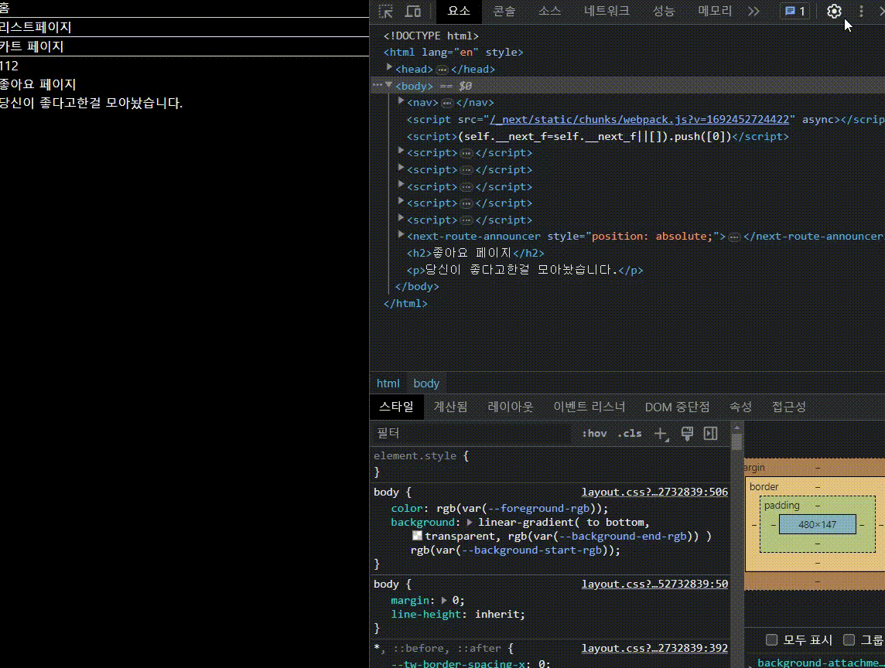
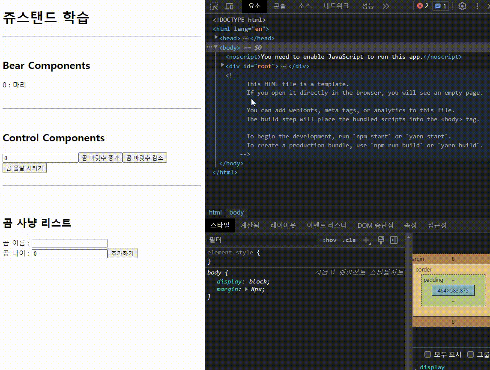

# NEXTJS 맛보기 !

## NEXT.JS란?

- NEXT JS는 REACT FRAMEWORK 다.
- REACT의 장점은 살리되, 다양한 편의 기능을 추가했다.

## SSR? CSP?

- SSR
  server side rendering
  - 클라이언트로 전달된 HTML 파일을 미리 그려서 내려주는것.
  - 클라이언트 렌더링의 속도를 빠르게 하여, 사용자 체감 속도 증진
  - 검색 엔진이 js를 실행하지 않고 크롤링 가능 SEO

 
 

- CSR

  client side rendering

  - SPA에서 파생됨
  - 비어있는 HTML을 받고 사용자가 필요할때 데이터를 받아 화면에 렌더링함.
  - 자바스크립트 사용이 불가할시 페이지 정상작동이 힘듬

## 주요 특징

- `Routing` A file-system based router built on top of Server Components that supports layouts, nested routing, loading states, error handling, and more.
   
  라우터 기능 => 페이지 이동

- `Rendering` Client-side and Server-side Rendering with Client and Server Components. Further optimized with Static and Dynamic Rendering on the server with Next.js. Streaming on Edge and Node.js runtimes.
   
  클라이언트 스테이트 , 서버 스테이트로 나뉘어져있음

- `Data` Fetching Simplified data fetching with async/await in Server Components, and an extended fetch API for request memoization, data caching and revalidation.
   
  await, async 더 좋아짐

- `Styling` Support for your preferred styling methods, including CSS Modules, Tailwind CSS, and CSS-in-JS
   
  테일윈드 깔려있음

- `Optimizations` Image, Fonts, and Script Optimizations to improve your application's Core Web Vitals and User Experience.
   
  최적화 더 쉬움

- `TypeScript` Improved support for TypeScript, with better type checking and more efficient compilation, as well as custom TypeScript Plugin and type checker.
   
  타입스크립트 쓸 수 있음

## Server Component, Client Component

- Server Component
  - 만들면 server component가됨
  - html에 자바스크립트 기능 넣기 불가능(useState, useEffect 등 사용불가능)
  - 로딩속도가 빠름, SEO문제 해결, 자바스크립트량이 적어져 로딩속도가 빠름
     
     
- Client Component
  - 코드 상단에 'use client'를 선언함
  - html에 자바스크립트 기능넣기 가능(useState, useEffect 사용 가능)
  - 모든 컴포넌트를 client component로 바꾸면 되는거 아니냐? => 맞음
  - 자바스크립트량이 많아져서 페이지 로딩이 보다 걸림, hydration 필요 리액트문법을 쓰기위해 (html을 유저에쏴 리액트로 분석)
     
     

### 그래서 결론이 뭐냐?

- `큰 페이지는 Server Component`
- `큰 페이지에서 JS 기능이 필요한 부분 Client Component`

### 그래서 언제 프로젝트만드냐
다음 TIL에서 작성하겠다.