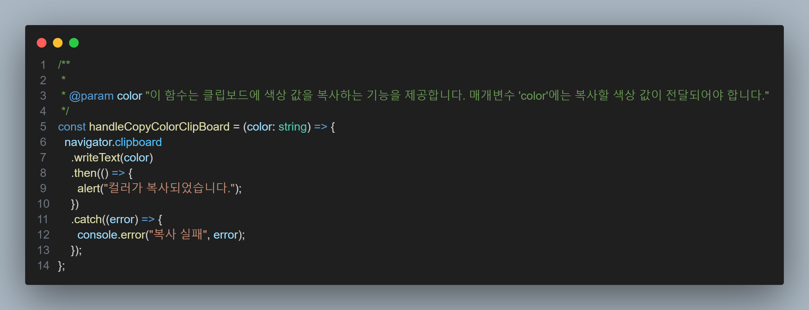

# 오늘의 TIL CLIP-BOARD


-`오늘 한일` 아이템을 클릭시 그 아이템의 색상코드를 클리보드에 저장했다.

## 내용

프로젝트 진행중 아이템을 클릭시 그 아이템의 색상코드를 클립보드에 저장하는 로직이 있었다.




아이템을 클릭시 색상에 저장하는 방식은 생각보다 쉽게 찾을 수 있었다.
간단히

```tsx
/**
 *
 * @param color "이 함수는 클립보드에 색상 값을 복사하는 기능을 제공합니다. 매개변수 'color'에는 복사할 색상 값이 전달되어야 합니다."
 */
const handleCopyColorClipBoard = (color: string) => {
  navigator.clipboard
    .writeText(color)
    .then(() => {
      alert("컬러가 복사되었습니다.");
    })
    .catch((error) => {
      console.error("복사 실패", error);
    });
};
```

이런식의 함수로 사용했다.
지금 문제가 then, catch 인대 이게 eslint 문제로 async, await,
try, catch 문을 사용하지 못하더라.. 그래서 일단 되는대로 then.catch를 사용했다.

라이브러리 사용도 생각해봤지만 클립보드의 량이 많이 않고,
여기말고는 사용할거 같지 않아 굳이 라이브러리를 사용하지 않아도 쉽게 만들 수 있어서 잘 생각한거같다.
