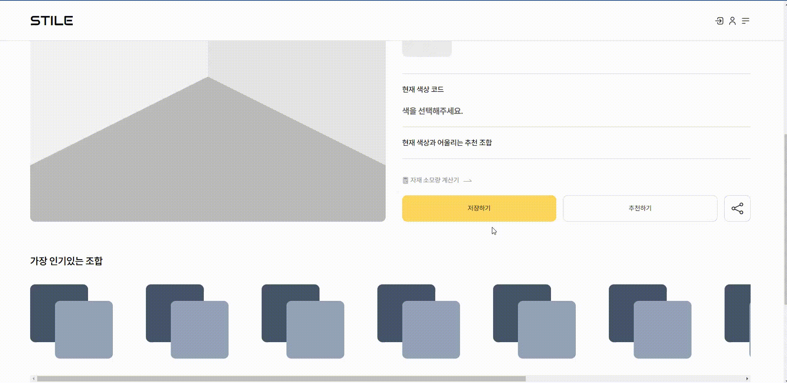

# 모달창 열릴시 scroll 막기


- `오늘의 문제` 모달창 열리고 닫혀서 좋아, 오버레이 클릭했을때도 닫혀, 근대 스크롤인되더라...

## 문제 코드

```tsx
// Modal.tsx
import React, { useEffect } from "react";

import closeBtn from "assets/close.svg";
import { useModalStore } from "store";

interface Props {
  children: React.ReactNode;
  title?: string;
}

export const Modal = ({ children, title }: Props): JSX.Element => {
  const { modalState, onCloseModal } = useModalStore((state) => state);

  //   페이지 입장, 이동시 모달창 닫게끄름
  useEffect(() => {
    onCloseModal();
    return onCloseModal;
  }, []);

  // 모달창 열리면 스크롤막기
  modalState ? (document.body.style.overflowY = "hidden") : (document.body.style.overflowY = "auto");

  // modalState값이 false라면 빈태그를 반환
  if (!modalState) return <></>;

  // 타입가드 type이 string 이거나 빈문자열이 아니라면?
  let titleBorder: string = "";
  const checkTypeGuard = typeof title === "string" && title !== "";
  if (checkTypeGuard) titleBorder = " border-b border-black";

  return (
    <>
      {/* 뒷배경 */}
      <div onMouseDown={onCloseModal} className="fixed top-0 bottom-0 left-0 right-0 block w-full h-full bg-[#00000040] z-[9998]"></div>
      {/* 모달 */}
      <div className="fixed z-[9999] top-[50%] left-[50%] p-10 bg-white  translate-x-[-50%] translate-y-[-50%]">
        {/* 모달 헤더 */}
        <div className={`flex items-center justify-between pb-3 mb-8 ${titleBorder}`}>
          <h2 className="font-semibold">{title}</h2>
          <button className="" onClick={onCloseModal}>
            
          </button>
        </div>
        {children}
      </div>
    </>
  );
};
```

모달창이고 `TailWind로` 작업을했다. <br/>
기존 CSS를 사용할려면 className부분을 바꿔주면 된다.

여기서 문제점은 모달창이 열렸을때, 스크롤이 된다는것이다.


모달창이 열린상태로 스크롤이 너무 자유분방하다.

## 해결방법



- `true`, `false` 모달창 상태관리하는 `boolean` 값으로 `overflowY` 값을 조절했다.
  <br/>
  <br/>

```tsx
// 스크롤 막음
// 모달을 관리하는 State 값으로
// 모달창이 열렸을때 => overflowY:'hidden',
// 모달창이 닫혔을때 => overflowY:'auto',
modalState ? (document.body.style.overflowY = "hidden") : (document.body.style.overflowY = "auto");
```

<br/>
<br/>
<br/>
<br/>

### 전체코드

```tsx
// NOTE:
// 사용방법
// Modal 을 import 합니다.
// Modal 안에 내용을 입력합니다
// ex <Modal><div><p>예시입니다.</p></div></Modal>
// title props로 모달의 제목을 컨트롤 할 수 있습니다.
// ex <Modal title='반달짐승의 표효'><p>어흥</p></Modal>

import React, { useEffect } from "react";

import closeBtn from "assets/close.svg";
import { useModalStore } from "store";

interface Props {
  children: React.ReactNode;
  title?: string;
}

export const Modal = ({ children, title }: Props): JSX.Element => {
  const { modalState, onCloseModal } = useModalStore((state) => state);

  //   페이지 입장, 이동시 모달창 닫게끄름
  useEffect(() => {
    onCloseModal();
    return onCloseModal;
  }, []);

  // 스크롤 막음
  modalState ? (document.body.style.overflowY = "hidden") : (document.body.style.overflowY = "auto");

  //   modalState값이 false라면 빈태그를 반환
  if (!modalState) return <></>;

  // 타입가드 type이 string 이거나 빈문자열이 아니라면?
  let titleBorder: string = "";
  const checkTypeGuard = typeof title === "string" && title !== "";
  if (checkTypeGuard) titleBorder = " border-b border-black";

  return (
    <>
      {/* 뒷배경 */}
      <div onMouseDown={onCloseModal} className="fixed top-0 bottom-0 left-0 right-0 block w-full h-full bg-[#00000040] z-[9998]"></div>
      {/* 모달 */}
      <div className="fixed z-[9999] top-[50%] left-[50%] p-10 bg-white  translate-x-[-50%] translate-y-[-50%]">
        {/* 모달 헤더 */}
        <div className={`flex items-center justify-between pb-3 mb-8 ${titleBorder}`}>
          <h2 className="font-semibold">{title}</h2>
          <button className="" onClick={onCloseModal}>
            
          </button>
        </div>
        {children}
      </div>
    </>
  );
};
```
