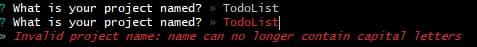

# NEXT JS 활용한 TODOLISST


- `오늘의 한일` next.js 를 사용하여 todolist 를 만들었다.
- 완성된 `todolist` 컴포넌트 분할과 클린코드도 진행하였다.
- https://github.com/muzi55/myFirstNextJS
  <br/>
  <br/>

## 프로젝트 셋팅

- `git bash` 를 열고 폴더위치까지 들어가

```
npx create-next-app

or

yarn create next-app
```

명령어를 실행해준다.

`CRA(react create app)` 이랑 다른점은 간단히 저것만 써주면 된다. 나머지는 옵션창이 나와서 거기서 선택을 하면 되는것이다.
<br/>
<br/>
<br/>


프로젝트 이름을 적으면 된다.
<br/>
<br/>
<br/>


프로젝트 이름을 대문자로하면 안된다.


이런 무지막지한 어마어마한일이 일어나서 해결은못하고 `컨트롤 + c` 를 눌러 다시 진행하였다.
<br/>
<br/>
<br/>


이름을 작성하였으면 기본적인 설정을 할 수 있다.
`typescript`, `eslint`, `tailwind`, `절대경로`, `touter`, `import alias`
<br/>
<br/>
<br/>


모든 작업이 완료되면 인스톨이 시작된다.

인스톨이 끝난후 해당 주소로 직접들어가 폴더를열거나

```
cd 폴더명

code
```

하게되면 vsCode 가 자동으로 열리게된다.

## TodoList 시작 하기에 앞서...

기존 `React`를 사용하다 오면 머리가 아찔해질것이다.

폴더구조가 다르기 때문이다.

### React Next 폴더구조

- `React` index.tsx, app.tsx 파일에서 뻗어나가는 반면,<br/>
- `Next` layout.tsx, page.tsx 파일에서 뻗어나간다.

<br/>

- `layout` 은 말그대로 레이아웃이다 가장 최상위 있는 layout 은 루트 layout 이며 layout으로 layout을 감싸고 page도 감싸고 다 감싼다.

- `page`는 말그대로 page로써, React의 components 같다고 생각하면 조금 더 쉬울것이다.

### 라우트 방식

- `React` => page 이동은 React-router-dom 라이브러리를 사용하여 페이지 이동함
- `Next` => 폴더명 => page.tsx 이런방식으로 간편하게 라우터기능을 사용할 수 있다.

더욱 자세한 내용은 공식문서를 보고 다음에 정리를 해보겠다. ! Next 공식문서 !! 기대해라

## 드디어 TodoList

`Next` 로 만든 Todo는 사실 리액트랑 별 반 다를게 없다.<br/>
`useState`를 사용하고 함수사용하고 리렌더링일으키고 ....다를게 없는대?

Next는 React와 가장 크게 다른점은
https://github.com/muzi55/TIL/blob/main/23-08/0821.md
정리를 해놨다. !

<br/>
<br/>
<br/>

여기서부터 본론이다.

```tsx
"use Client";
import React, { useState, useRef } from "react";
interface Props {}

interface Todo {
  id: number;
  title: string;
  isDone: boolean;
}
const Todo = ({}: Props): JSX.Element => {
  const [title, setTitle] = useState("");
  const [todoList, setTodoList] = useState<Todo[]>([
    {
      id: 0,
      title: "운동하기",
      isDone: false,
    },
    {
      id: 1,
      title: "공부하기",
      isDone: true,
    },
    {
      id: 2,
      title: "장보기",
      isDone: false,
    },
    {
      id: 4,
      title: "요리하기",
      isDone: false,
    },
  ]);
  const idRef = useRef(todoList.length);

  const handleAddTodo = () => {
    const addTodo = {
      id: ++idRef.current,
      title,
      isDone: false,
    };
    setTodoList((prev) => [...prev, addTodo]);
    console.log(addTodo);
  };

  const handleSwitchTodoBtn = (id: number) => {
    const switchTodo = todoList.map((el) => (el.id === id ? { ...el, isDone: !el.isDone } : el));
    setTodoList(switchTodo);
  };

  const handleSubmit = (e: React.FormEvent<HTMLFormElement>) => {
    e.preventDefault();
    handleAddTodo();
  };

  const handleTodoDeleteBtn = (id: number) => {
    const filterData = todoList.filter((el) => el.id !== id);
    setTodoList(filterData);
  };
  return (
    <>
      <form onSubmit={handleSubmit}>
        <input className="text-black" type="text" onChange={(e) => setTitle(e.target.value)} value={title} />
        <button type="submit">추가하기</button>
      </form>
      {title}

      <div className="bg-gray-200 p-4 border border-[#451289] mb-10">
        <h2 className="text-lg font-bold">진행중 목록</h2>
        {todoList
          .filter((el) => el.isDone === false)
          .map((el) => {
            return (
              <div key={el.id} className="flex">
                <h3 className="mr-5">{el.title}</h3>
                <button className="border border-black" onClick={() => handleSwitchTodoBtn(el.id)}>
                  완료 버튼
                </button>
                <button className="border border-black" onClick={() => handleTodoDeleteBtn(el.id)}>
                  삭제 버튼
                </button>
              </div>
            );
          })}
      </div>

      <div className="bg-gray-200 p-4 border border-[#666]">
        <h2 className="text-lg font-bold">완료한 목록</h2>
        {todoList
          .filter((el) => el.isDone === true)
          .map((el) => {
            return (
              <div key={el.id} className="flex">
                <h3 className="mr-5">{el.title}</h3>
                <button className="border border-black" onClick={() => handleSwitchTodoBtn(el.id)}>
                  완료 버튼
                </button>
                <button className="border border-black" onClick={() => handleTodoDeleteBtn(el.id)}>
                  삭제 버튼
                </button>
              </div>
            );
          })}
      </div>
    </>
  );
};

export default Todo;
```

이런식의 코드를 만들었다.

정말 길고 재사용성없고 난잡하다.

이걸 이렇게 바꾸었다.
<br/>
<br/>

1.  `useState의 들어가는 기본값을 `constant` 라는 파일에서 받아오는 형식으로 바꾸었다.

    ```tsx
    // constant.ts
    export const INITIAL_TODOLIST = [
      {
        id: 0,
        title: "운동하기",
        isDone: false,
      },
      {
        id: 1,
        title: "공부하기",
        isDone: true,
      },
      {
        id: 2,
        title: "장보기",
        isDone: false,
      },
      {
        id: 4,
        title: "요리하기",
        isDone: false,
      },
    ];
    ```

    <br/>
    <br/>

2.  자주사용되는 타입을 type.ts 에서 불러와 사용했다.

    ```ts
    // type.ts
    export interface Todo {
      id: number;
      title: string;
      isDone: boolean;
    }
    ```

       <br/>
    <br/>

3.  재사용되는 부분을 컴포넌트화 시켰다.

    ```tsx
    //  TodoList.tsx
    "use client";
    import React from "react";
    import { type Todo } from "../type";
    interface Props {
      isDone: boolean;
      todoList: Todo[];
      handleSwitchTodoBtn: (id: number) => void;
      handleTodoDeleteBtn: (id: number) => void;
    }

    const TodoList = ({ isDone, todoList, handleSwitchTodoBtn, handleTodoDeleteBtn }: Props): JSX.Element => {
      return (
        <>
          <div className="bg-gray-200 p-4 border border-[#451289] mb-10">
            <h2 className="text-lg font-bold">진행중 목록</h2>
            {todoList
              .filter((el) => el.isDone === isDone)
              .map((el) => {
                return (
                  <div key={el.id} className="flex">
                    <h3 className="mr-5">{el.title}</h3>
                    <button className="border border-black" onClick={() => handleSwitchTodoBtn(el.id)}>
                      완료 버튼
                    </button>
                    <button className="border border-black" onClick={() => handleTodoDeleteBtn(el.id)}>
                      삭제 버튼
                    </button>
                  </div>
                );
              })}
          </div>
        </>
      );
    };

    export default TodoList;
    ```

       <br/>
    <br/>

4.  최종코드

        ```tsx
        // Todo.tsx
        "use client";
        import React, { useState, useRef } from "react";
        import { INITIAL_TODOLIST } from "../constant";
        import { type Todo } from "../type";
        import TodoList from "./TodoList";
        interface Props {}

        const Todo = ({}: Props): JSX.Element => {
          const [title, setTitle] = useState("");
          const [todoList, setTodoList] = useState<Todo[]>(INITIAL_TODOLIST);
          const idRef = useRef(todoList.length);

          const handleAddTodo = () => {
            const addTodo = {
              id: ++idRef.current,
              title,
              isDone: false,
            };
            setTodoList((prev) => [...prev, addTodo]);
            console.log(addTodo);
          };

          const handleSwitchTodoBtn = (id: number) => {
            const switchTodo = todoList.map((el) => (el.id === id ? { ...el, isDone: !el.isDone } : el));
            setTodoList(switchTodo);
          };

          const handleTodoDeleteBtn = (id: number) => {
            const filterData = todoList.filter((el) => el.id !== id);
            setTodoList(filterData);
          };

          const handleSubmit = (e: React.FormEvent<HTMLFormElement>) => {
            e.preventDefault();
            if (title.length === 0) return;
            handleAddTodo();
            setTitle("");
          };

          return (
            <>
              <form className="border border-black p-2 bg-red-200" onSubmit={handleSubmit}>
                <input className="text-black mr-2" type="text" onChange={(e) => setTitle(e.target.value)} value={title} />
                <button type="submit">추가하기</button>
              </form>

              <TodoList isDone={false} todoList={todoList} handleSwitchTodoBtn={handleSwitchTodoBtn} handleTodoDeleteBtn={handleTodoDeleteBtn} />
              <TodoList isDone={true} todoList={todoList} handleSwitchTodoBtn={handleSwitchTodoBtn} handleTodoDeleteBtn={handleTodoDeleteBtn} />
            </>
          );
        };

        export default Todo;
        ```
        <br/>

    <br/>

props가 많긴하지만, 짧아지고 읽기 훨씬 용의해졌다.

앞으로 Next에 대해 자세히 공부해서 프로젝트 진행에 불편함 없게 배워야겠다.
