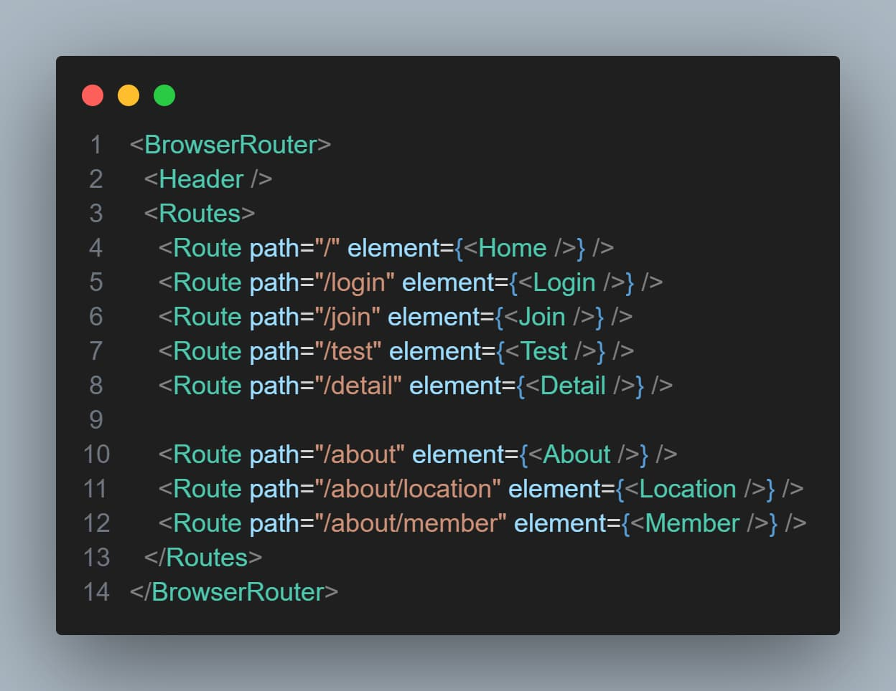
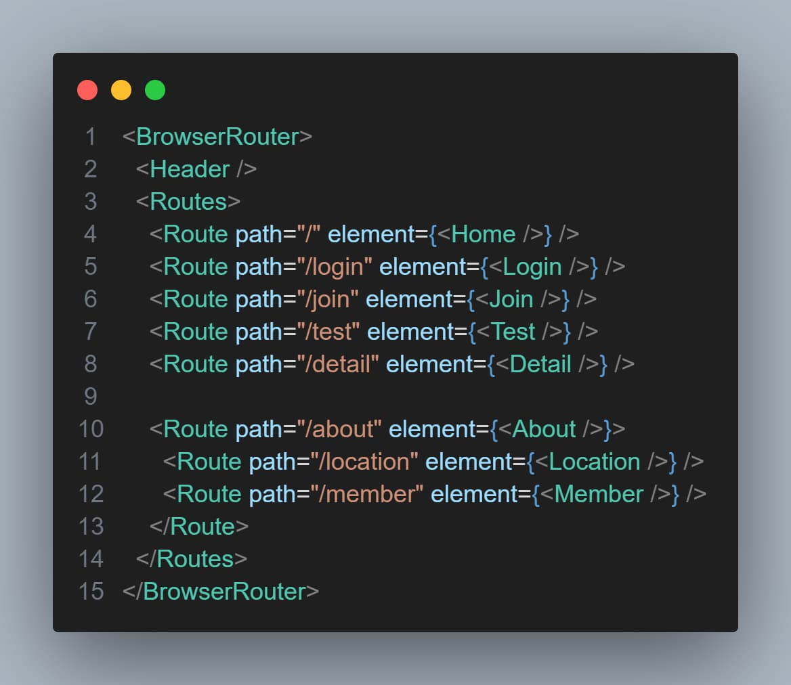
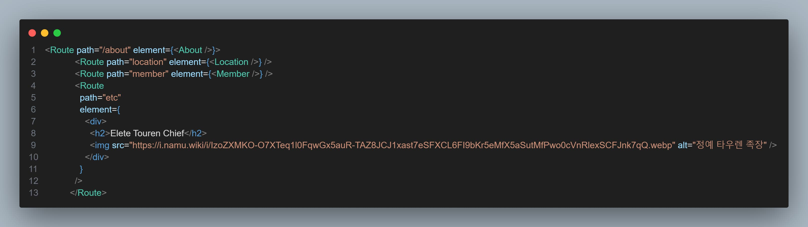
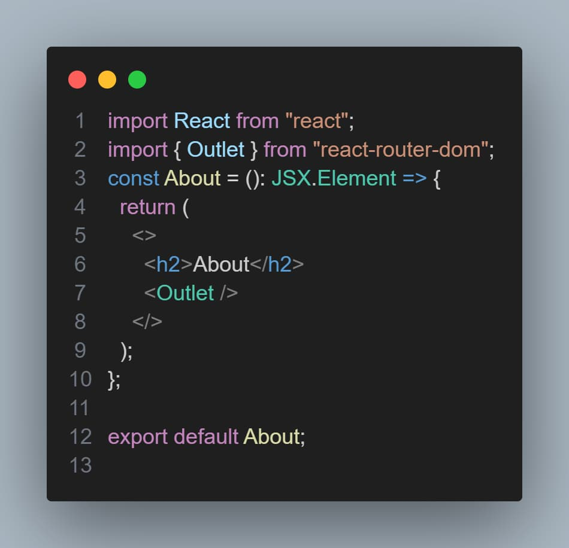

# React-Router Nested, Outlet


- `오늘의 한일` Nested와 Outlet을 자유자재로 사용할 수 있다!.
- [깃 주소](https://github.com/muzi55/React_Router_NestedRoutesOrOutlet)

## Nested, Outlet ?

- `Nested` 중첩된 라우팅<br/>

- 중첩된 라우팅은 주로 대형 애플리케이션에서 페이지나 컴포넌트의 계층 구조를 만들때 유용합니다
- 중첩된 라우팅을 사용하면 여러 컴포넌트를 중첩시키고 해당 컴포넌트들 간에 다른 경로를 정의할 수 있습니다.

### 코드는 ?

`기존 코드`


`중첩라우팅 된 코드`


```tsx
// Router.tsx
<Route path="/about" element={<Route />}>
  <Route path="member" element={<Member />}></Route>
</Route>
```

이런식으로 `라우트` 안에 `라우트` 를 사용해주면된다.

이로써 이전과 같은 코드와 같이 작동한다.

## Outlet

`Outlet` 은 React Router v6 에 도입된 개념으로 중첩된 라우팅 구조에서 하위 라우터의 결과를 표시하는데 사용됩니다.

### 코드는 ?

`라우트 element 속성에 html, 컴포넌트를 넣고`


`outlet을 선언해주면 된다.`



해당결과 h2태그와 img가 정상적으로 출력이된다.
