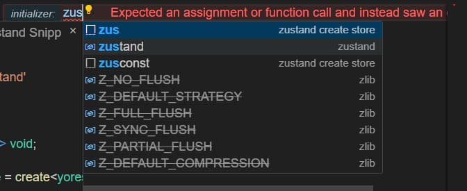
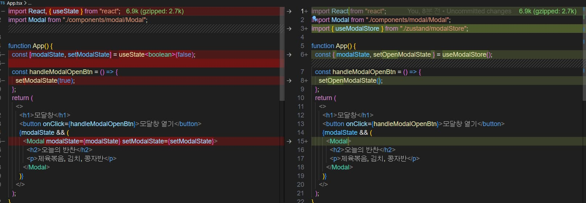
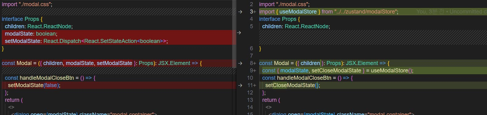

# 모달창 전역상태관리(zustand)


- `오늘의 할일` zustand를 사용하여 모달창 전역상태관리하기
- [주소](https://github.com/muzi55/react_modal/tree/globalState)
- [이전에 썻던 `zustand` TIL 보로가기](https://github.com/muzi55/TIL/blob/main/23-08/0817zustand%20%EC%82%AC%EC%9A%A9%ED%95%98%EA%B8%B0.md)
  <br/>
  <br/>
  <br/>

## redux?, zustand?

전역상태관리한다고하면 기본적으로 `redux`를 떠올릴것이다.

나도그렇고 대부분 그렇다. 하지만 리덕스는 보일러플레이트 코드가 많다는 단점이있다.

간단한 모달창을 만드는만큼 zustand로 전역상태를 관리하는게 더 이롭다고 판단된다.
<br/>
<br/>
<br/>

## zustand

- [`zustand`](https://github.com/pmndrs/zustand)는 상태관리를 하는 라이브러리 중 하나이다.
- 보일러 플레이트 코드가 적다.
- zustand는 내부적으로 immer와 함께 사용되어 불변성을 유지하면서 상태를 업데이트 할 수 있도록 도와준다.
  <br/>
  <br/>
  <br/>

### zustand 인스톨

```
npm install zustand

or

yarn zustand
```

## zustand Snippet


vs코드 확장자중 Zustand Snippet 이라고 코드조각인대 zustand를 사용할때 정말 편해진다.
<br/>

```
// 사용방법
zus

컨트롤 + 스페이스바
```


<br/>
<br/>

```ts
// modalStore.ts
import { create } from "zustand";

interface yorestore {
  yourState: any;
  yourAction: (val: any) => void;
}
export const useyorestore = create<yorestore>((set) => ({
  yourState: "VALUE",
  yourAction: (val) => set((state) => ({ yourState: state.yourState })),
}));
```

여기서 이름, 인터페이스, 타입을 바꾸어 사용하면 된다.
<br/>
<br/>
<br/>

## zustandStore 코드

```tsx
//modalStore.tss
import { create } from "zustand";

interface ModalType {
  modalState: boolean;
  setOpenModalState: () => void;
  setCloseModalState: () => void;
}
export const useModalStore = create<ModalType>((set) => ({
  modalState: false,
  setOpenModalState: () => set(() => ({ modalState: true })),
  setCloseModalState: () => set(() => ({ modalState: false })),
}));
```

zustandStore 파일이다.

modalState는 이전 useState 훅처럼 boolean 값을 가지고있으며 이것으로 모달창이 열리고 닫힌다.

setOpenModalState, setCloseModalState 함수는 모달창을 열고, 닫는 함수이다.

<br/>
<br/>
<br/>

### 기존코드 바꾸기



```tsx
//App.tsx
import React from "react";
import Modal from "./components/modal/Modal";
import { useModalStore } from "./zustand/modalStore";

function App() {
  const { modalState, setOpenModalState } = useModalStore();
  const handleModalOpenBtn = () => {
    setOpenModalState();
  };
  return (
    <>
      <h1>모달창</h1>
      <button onClick={handleModalOpenBtn}>모달창 열기</button>
      {modalState && (
        <Modal>
          <h2>오늘의 반찬</h2>
          <p>제육볶음, 김치, 콩자반</p>
        </Modal>
      )}
    </>
  );
}

export default App;
```

위에서부터보면 useState 훅이 사라졌다. (전역으로 관리하니까)<br/>
Modal 컴포넌트로 들어가는 props가 사라졌다.

<br/>
<br/>
<br/>



```tsx
//Modal.tsx
import React from "react";
import "./modal.css";
import { useModalStore } from "../../zustand/modalStore";
interface Props {
  children: React.ReactNode;
}

const Modal = ({ children }: Props): JSX.Element => {
  const { modalState, setCloseModalState } = useModalStore();
  const handleModalCloseBtn = () => {
    setCloseModalState();
  };
  return (
    <>
      <dialog open={modalState} className="modal-container">
        <button onClick={handleModalCloseBtn} className="modal-close__button">
          X
        </button>
        {children}
      </dialog>
      <div onClick={handleModalCloseBtn} className="modal-bg"></div>
    </>
  );
};

export default Modal;
```

Modal 컴포넌트도 크게 바뀐건 없다.

기존 props로 받는 타입과, setModalState => setCloseModalState 로 바뀐것뿐이 없다.

전역으로 관리하는게 지금은 딱히 의미없다고 본다.(컴포넌트간의 깊이가 얕음)
