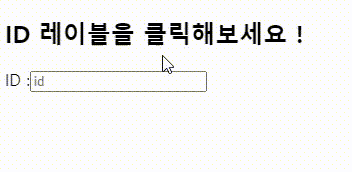

# useId 사용해보기


- `오늘의 한일` `useId`를 사용하여 고유한 ID 생성하기
- [](https://codesandbox.io/s/react-useid-t4vwn6?autoresize=1&fontsize=14&hidenavigation=1&module=%2Fsrc%2FApp.js&theme=dark)

  <br/>
  <br/>
  <br/>

## useId

`useId`는 특정 컴포넌트 내 특정 `useId` 와 관련된 고유 ID 문자열을 반환함!

key를 생성하기 위해 사용하면 안됨!

```jsx
// useId 훅 사용 예시
const id = useId();
```

<br/>
<br/>
<br/>

```jsx
import react, {useId} from `react`;

function MyComponents(){
    const userId = useId();
    // ...
```

컴포넌트 최상단에서 useId를 호출하여 고유한 ID를 생성합니다.

<br/>
<br/>
<br/>

```jsx
<>
  <input type="text" aria-userId={userId} />
  <p id={userId}> ... </p>
</>
```

생성된 ID를 다른 속성에 전달할 수 있습니다.
<br/>
<br/>
<br/>

### 코드


<br/>
<br/>
<br/>
<br/>
[](https://codesandbox.io/s/react-useid-9dg93p?autoresize=1&fontsize=14&hidenavigation=1&theme=dark)

```jsx
import { useId } from "react";
import "./styles.css";

export default function App() {
  const userId = useId();

  return (
    <>
      <h2> ID 레이블을 클릭해보세요 !</h2>
      <label style={{ cursor: "pointer" }} title="나를 클릭해보세요" htmlFor={userId}>
        ID :
      </label>
      <input type="text" id={userId} placeholder="id" maxLength="6" />
    </>
  );
}
```

<br/>
<br/>
<br/>

<blockquote>
However, hardcoding IDs like this is not a good practice in React. A component may be rendered more than once on the page—but IDs have to be unique! Instead of hardcoding an ID, generate a unique ID with useId:
</blockquote>
<br/>
인풋 옆의 'ID' 레이블을 클릭해 보면, 해당 ID가 연결된 인풋 요소로 포커스가 이동합니다.

이렇게 하는 이유는 ID를 직접 하드코딩하는 것은 권장되지 않는 React의 좋은 습관이 아니기 때문입니다.

컴포넌트가 페이지에서 여러 번 렌더링될 수 있지만 `ID는 고유해야 합니다.`

그래서 ID를 직접 하드코딩하는 대신, useId를 사용하여 고유한 ID를 생성하는 것이 좋습니다.
