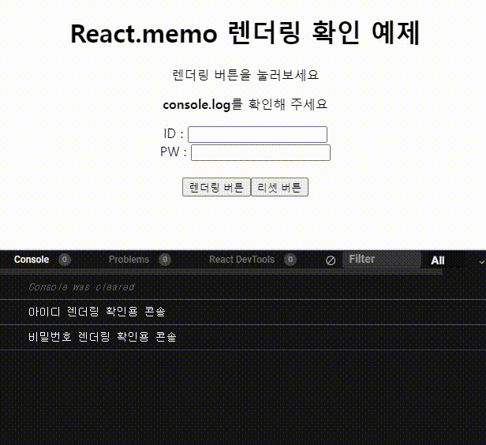

# React.memo


- `오늘의 한일` React.memo 를 사용하여 컴포넌트 최적화하기
  <br/>
  <br/>
  <br/>

## React.memo

`React.memo`를 사용하면 컴포넌의 props가 변경되지 않은 경웅 리렌더링을 건너뛴다.

```jsx
const MyComponent = React.memo(Component);

const MyComponent = memo(Component, arePropsEqual?);
```

<br/>
<br/>
<br/>

## React.memo useMemo?

`React.memo` 는 `useMemo`와 다르다.

`React.memo` 컴포넌트의 `props의 변화를 감지`하여 렌더링 되는지 판단함<br/>
`useMemo` 함수의 결과값을 메모리에 저장하여 `deps( [ ] )의 값이 바뀌었을때 다시 실행됨`
<br/>
<br/>
<br/>

## 코드 샌드박스

[](https://codesandbox.io/s/react-memo-sayongyesi-j553h2?autoresize=1&expanddevtools=1&fontsize=14&hidenavigation=1&theme=dark)



1. 처음 렌더링이 되었을때 콘솔로 아이디 컴포넌트와 비밀번호 컴포넌트 두개가 콘솔로 찍힌다.
2. 그리고 렌더링 버튼을 누르면 렌더값이 1씩 증가되여 화면이 리렌더링 되는 방식이다.
3. 하지만 아이디 컴포넌트만 리렌더링이 되고 비밀번호 컴포넌트는 리렌더링 되지 아니한다.
4. 이러한 이유는 비밀번호 컴포넌트의 `props의 값이 바뀌지 않기 때문`이다. !
   <br/>
   <br/>
   <br/>

이처럼 `React.memo`는 불필요한 리렌더링을 방지하기위해 사용되는 최적화 방식이란걸 알 수 있었다.
