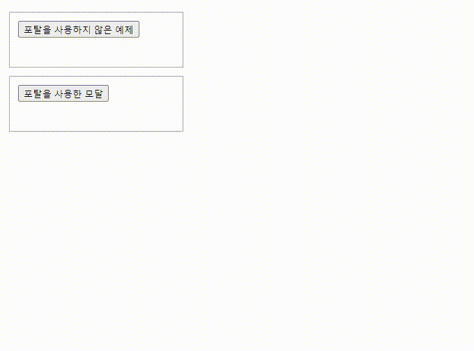

# createPortal


- `오늘의 한 일` `createPortal`을 사용하여 모달 창 만들기
- `CodeSandBox` [](https://codesandbox.io/s/createportal-yeje-lp8xd4?fontsize=14&hidenavigation=1&theme=dark)
  <br/>
  <br/>
  <br/>

## [기존의 모달](https://github.com/muzi55/TIL/blob/main/23-10/1002%EB%AA%A8%EB%8B%AC%EC%B0%BD.md)

[이전 모달 TIL 주소](https://github.com/muzi55/TIL/blob/main/23-10/1002%EB%AA%A8%EB%8B%AC%EC%B0%BD.md)

기존의 코드는 `useState`를 사용하여 모달 창을 열고 닫는 방식이었습니다.

`createPortal`을 사용하여 모달 창을 만들어보겠습니다.
<br/>
<br/>
<br/>

## portal

리액트에서 `createPortal`을 왜 사용하는 것일까요?

`createPortal`을 사용하면 일부 자식을 DOM의 다른 부분으로 렌더링할 수 있습니다.

```jsx
import {createPortal} from 'react-dom';

<div>
    <MyComponent />
    {
        createPortal(children, domNode, key?)
    }
</div>
```

<br/>
<br/>
<br/>

### 모달 창을 createPortal로 만드는 이유

1. 렌더링 위치 제어: 모달 창을 원하는 위치에서 렌더링할 수 있습니다.
2. z-index 관리: 포탈을 사용하면 모달 창이 다른 요소 위에 레이어로 표시될 수 있으므로 z-index 관리가 수월해집니다.
3. 이벤트 처리: 모달 창 외부를 클릭하거나 ESC 키를 눌러 모달을 닫는 이벤트 처리가 쉽게 가능합니다.

이런 이유가 있습니다.
<br/>
<br/>
<br/>

## CodeSandBox

[](https://codesandbox.io/s/createportal-yeje-lp8xd4?fontsize=14&hidenavigation=1&theme=dark)



위 이미지를 보면 모달 창이 열리는 위치가 다릅니다

위 컴포넌트는 `createPortal`을 사용하지 않아 HTML의 흐름대로 아래에 생성되었지만

아래 컴포넌트는 `createPortal`의 `domNode`를 설정하여 모달 창이 그 곳에 생성되었습니다.

<br/>
<br/>
<br/>

React의 `createPortal`을 활용하여 모달 창을 만드는 방법을 알아보았습니다.

`createPortal`을 사용하면 모달 창의 렌더링 위치를 제어하고 z-index를 관리하는 등의 장점이 있습니다. 이 기술을 활용하면 웹 애플리케이션에서 모달 창을 보다 효과적으로 다룰 수 있습니다.
